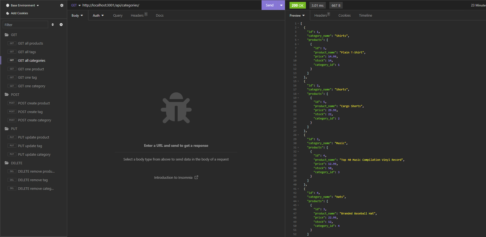

# Ecommerce-backend-v1

## License

The ISC License simply removes language that would be considered extraneous according to the Berne Convention. The ISC License is considered equivalent to the Simplified (2-Clause) BSD License but with more concise language.

## Description
This application is a light-weight ecommerce DB app with simple add, delete, update or view functionality to your products/categories or tags.
It is run directly in your CLI.
Recommended use with Insomnia.

Take a look at the picture below for a preview!

For a video overview of the application: https://youtu.be/r1WN3sHrbWk

## Table of Contents
- [Description](#description)
- [Installation](#installation)
- [Usage](#usage)
- [License](#license)
- [Questions](#questions)

## Installation
- This app requires node.js and packages: 
- express
- dotenv
- mysql2
- sequelize

## Usage
- Log into your mysql CLI and run "source db/schema.sql", then exit.
- Type "npm run seed" to get your seeds added to your db.
- Type "npm run start" to get the app started via the server.js file.

## Questions
- For any questions or concerns, please reach out to me through the following contact information:

- Github: [mHammy](https://github.com/mHammy)
- Email: matthewrhamiltonis@gmail.com